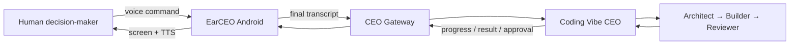

# EarCEO

**A voice-first command center for an AI agent team.**

EarCEO turns iFLYBUDS Pro 3 into a wearable interface for delegating work to a
CEO agent. The human speaks, reviews important decisions, and stays in control;
the CEO agent converts the request into structured work and coordinates the
specialist agents.

Built for AdventureX 2026.

## Product idea



The human remains above the system:

1. **Human** — defines goals, constraints and approval boundaries.
2. **CEO agent** — interprets intent, delegates work and compresses results.
3. **Agent team** — researches, implements, tests and reviews.

## Current status

The complete local headset pipeline is working:

```text
iFLYBUDS microphone
  → viaim PCM
  → background WAV capture
  → viaim text-stream Partial / Final
  → Android display
```

Implemented:

- viaim SDK initialization with local AppKey/AppSecret injection
- `voice-stream` and `text-stream` capability detection
- PCM-only fallback when credentials are unavailable
- Bluetooth permissions, paired-device lookup and SPP connection
- left/right battery and in-case state
- live PCM frame, byte and channel diagnostics
- background 16-bit / 16 kHz / mono WAV capture
- WAV export through the Android file picker
- live Partial and accumulated Final transcript display
- dialog lifecycle logging
- safe cleanup after PCM or text-stream failures
- logs that exclude credentials and full transcript contents

Real-device validation:

| Device | Result |
| --- | --- |
| Huawei Mate 60 + iFLYBUDS Pro 3 | SPP, authentication, PCM, WAV and Partial/Final text-stream passed |
| OnePlus Ace 3 Pro / ColorOS 16.0.5 | SPP and device state passed; live recording returned vendor SDK timeout |

The latest successful Huawei test produced a 12.2-second, 391,212-byte WAV
while PCM and text-stream ran together.

## Two-repository architecture

EarCEO deliberately does not reimplement the CEO or agent orchestration.

| Repository | Owner | Responsibility |
| --- | --- | --- |
| [`hlzx-cpu/EarCEO`](https://github.com/hlzx-cpu/EarCEO) | Android/headset workstream | iFLYBUDS connection, recording, transcript assembly, CEO transport, result UI and TTS |
| [`onezion12344/coding-vibe`](https://github.com/onezion12344/coding-vibe) | CEO/backend workstream | CEO reasoning, delegation, checkpoints, OpenOPC Architect→Builder→Reviewer execution |

`coding-vibe` already contains:

- `CodingVibeAgent`
- the `delegate_coding` function tool
- a five-tool MCP checkpoint/delegation server
- optional LiveKit, Deepgram and DeepSeek voice mode
- OpenOPC integration

The next shared component is a small **CEO Gateway**. It exposes the existing
backend capabilities to Android without moving orchestration logic into this
repository.

## Next vertical slice

The next milestone is:

```text
Speak command
  → collect sentence-level Final results
  → stop and review one command draft
  → submit final text to CEO Gateway
  → receive accepted/progress/completed events
  → show result on Android
```

Important product rule: one viaim `Final` callback is a sentence, not
necessarily a complete CEO task. The MVP aggregates all Final text from one
recording session and submits only after the user stops and confirms.

The integration uses:

- REST for session creation, command submission and approvals
- Server-Sent Events (SSE) for progress and result delivery
- client-generated IDs for idempotent retries
- text-only transport for the MVP; raw PCM and WAV stay on the phone

See:

- [Android ↔ CEO API contract](docs/backend-contract.md)
- [Development plan](docs/development-plan.md)
- [Architecture and risk policy](docs/architecture.md)
- [Android setup and device validation](docs/android-development.md)

## Repository layout

```text
android/
  app/src/main/java/com/earceo/app/
    MainActivity.kt       Headset, recording and transcript probe
    WavRecorder.kt        Non-blocking PCM-to-WAV writer
docs/
  architecture.md         Product layers and approval boundaries
  backend-contract.md     Proposed Android ↔ CEO protocol
  development-plan.md     Milestones, ownership and acceptance criteria
  android-development.md  Toolchain and real-device test notes
scripts/
  check-public-repo.sh    Secret and vendor-artifact safety checks
```

## Local setup

Prerequisites:

- JDK 17
- Android SDK API 35
- Android device with USB debugging
- paired iFLYBUDS Pro 3
- official `VisionHeadsetOpen-v1.0.0.aar`

Place the vendor AAR locally:

```text
android/app/libs/VisionHeadsetOpen-v1.0.0.aar
```

Create the ignored local configuration:

```bash
cp android/local.properties.example android/local.properties
```

Then configure:

```properties
sdk.dir=/Users/your-name/Library/Android/sdk
viaim.appKey=
viaim.appSecret=
```

Build and validate:

```bash
cd android
./gradlew :app:assembleDebug :app:lintDebug
../scripts/check-public-repo.sh
```

The APK is generated at:

```text
android/app/build/outputs/apk/debug/app-debug.apk
```

## Demo definition of done

The first Android-to-CEO demo is complete when:

1. the user records one command through iFLYBUDS;
2. Android displays the assembled command before submission;
3. the backend acknowledges the command within two seconds on the same LAN;
4. Android shows at least one progress event;
5. `coding-vibe` delegates the task to its existing CEO/agent flow;
6. Android displays a concise completion result;
7. retrying the same `client_turn_id` does not create a duplicate task;
8. no AppSecret, backend token, WAV or full transcript is written to logs.

TTS playback and voice approval are the following milestone, not a blocker for
this first end-to-end text loop.

## Safety

This is a public repository. It intentionally excludes:

- viaim AppKey or AppSecret values
- backend access tokens
- the vendor AAR and original vendor demo
- generated APKs, WAV files and build outputs
- local Android SDK paths

Risk policy:

| Level | Example | Default |
| --- | --- | --- |
| R0 | Read, search, summarize | Automatic |
| R1 | Draft code, run tests | Inform user; allow cancellation |
| R2 | Send, publish, deploy test build | Explicit approval |
| R3 | Delete, pay, change access, production deploy | Never complete by voice alone |

## Roadmap

- [x] Headset connection and device telemetry
- [x] PCM and WAV capture
- [x] Authenticated Partial/Final text-stream
- [ ] Command draft aggregation and explicit submit
- [ ] Android CEO API client
- [ ] `coding-vibe` CEO Gateway
- [ ] Progress and completion events
- [ ] Approval cards and response flow
- [ ] Android TTS with half-duplex audio
- [ ] Reconnect, queueing and session recovery
- [ ] Foreground service and product UI
