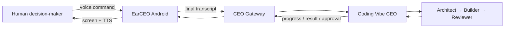

# EarCEO

**A voice-first command center for an AI agent team.**

EarCEO turns iFLYBUDS Pro 3 into a wearable interface for delegating work to a
CEO agent. The human speaks, reviews important decisions, and stays in control;
the CEO agent converts the request into structured work and coordinates the
specialist agents.

Built for AdventureX 2026.

## Product idea



The human remains above the system:

1. **Human** — defines goals, constraints and approval boundaries.
2. **CEO agent** — interprets intent, delegates work and compresses results.
3. **Agent team** — researches, implements, tests and reviews.

## Current status

The complete local headset pipeline is working:

```text
iFLYBUDS microphone
  → viaim PCM
  → background WAV capture
  → viaim text-stream Partial / Final
  → Android display
```

Implemented:

- viaim SDK initialization with local AppKey/AppSecret injection
- `voice-stream` and `text-stream` capability detection
- PCM-only fallback when credentials are unavailable
- Bluetooth permissions, paired-device lookup and SPP connection
- left/right battery and in-case state
- live PCM frame, byte and channel diagnostics
- background 16-bit / 16 kHz / mono WAV capture
- WAV export through the Android file picker
- live Partial and accumulated Final transcript display
- dialog lifecycle logging
- safe cleanup after PCM or text-stream failures
- logs that exclude credentials and full transcript contents
- one reviewed command draft per recording session
- explicit Submit, Discard and Cancel controls
- authenticated Android REST client with stable session/turn IDs
- resumable SSE progress and terminal result handling
- an in-repository CEO Gateway with project allow-listing and idempotent turns
- a durable backend task lifecycle shared by Web, MCP and Android

Real-device validation:

| Device | Result |
| --- | --- |
| Huawei Mate 60 + iFLYBUDS Pro 3 | SPP, authentication, PCM, WAV and Partial/Final text-stream passed |
| OnePlus Ace 3 Pro / ColorOS 16.0.5 | SPP and device state passed; live recording returned vendor SDK timeout |

The latest successful Huawei test produced a 12.2-second, 391,212-byte WAV
while PCM and text-stream ran together.

## Monorepo architecture

EarCEO is now one project in one repository:

| Directory | Responsibility |
| --- | --- |
| `android/` | iFLYBUDS connection, PCM/WAV, Final transcript aggregation, review UI, REST/SSE client and result UI |
| `backend/` | CEO Gateway, durable task lifecycle, adapters, MCP bridge, Web API and tests |
| `docs/` | shared protocol, architecture, safety policy and integration plan |

The backend core was derived from
[`onezion12344/coding-vibe`](https://github.com/onezion12344/coding-vibe), then
refactored inside EarCEO. Android never receives repository paths or provider
credentials; it sends an allow-listed `project_id`.

## Implemented vertical slice

The code now implements:

```text
Speak command
  → collect sentence-level Final results
  → stop and review one command draft
  → explicitly submit final text to CEO Gateway
  → receive accepted/progress/completed events
  → show result on Android
```

Important product rule: one viaim `Final` callback is a sentence, not
necessarily a complete CEO task. The MVP aggregates all Final text from one
recording session and submits only after the user stops and confirms.

The integration uses:

- REST for session creation, command submission and approvals
- Server-Sent Events (SSE) for progress and result delivery
- client-generated IDs for idempotent retries
- text-only transport; raw PCM and WAV stay on the phone

The remaining acceptance step is a real-device LAN run against the included
Gateway, first with `mock`, then with `claude-code` on a disposable repository.

See:

- [Android ↔ CEO API contract](docs/backend-contract.md)
- [Development plan](docs/development-plan.md)
- [Architecture and risk policy](docs/architecture.md)
- [Android setup and device validation](docs/android-development.md)
- [Next-session handoff](docs/next-session-handoff.md)

## Repository layout

```text
android/
  app/src/main/java/com/earceo/app/
    MainActivity.kt       Headset, recording and transcript probe
    WavRecorder.kt        Non-blocking PCM-to-WAV writer
    CommandDraft.kt       Final sentence aggregation + idempotent turn state
    EarCeoApiClient.kt    Authenticated REST + SSE client
backend/
  receptionist/           Durable task lifecycle and harness adapters
  web/mobile_api.py       Android-facing /v1 Gateway
  cv_mcp/                 Shared MCP checkpoint/delegation bridge
docs/
  architecture.md         Product layers and approval boundaries
  backend-contract.md     Implemented Android ↔ CEO core protocol
  development-plan.md     Milestones, ownership and acceptance criteria
  android-development.md  Toolchain and real-device test notes
scripts/
  check-public-repo.sh    Secret and vendor-artifact safety checks
```

## Local setup

Prerequisites:

- JDK 17
- Android SDK API 35
- Android device with USB debugging
- paired iFLYBUDS Pro 3
- official `VisionHeadsetOpen-v1.0.0.aar`

Place the vendor AAR locally:

```text
android/app/libs/VisionHeadsetOpen-v1.0.0.aar
```

Create the ignored local configuration:

```bash
cp android/local.properties.example android/local.properties
```

Then configure:

```properties
sdk.dir=/Users/your-name/Library/Android/sdk
viaim.appKey=
viaim.appSecret=
earceo.backendUrl=http://<mac-lan-ip>:8787
earceo.apiToken=<same-token-as-backend>
earceo.projectId=adventurex-demo
```

Create the backend environment:

```bash
uv venv backend/.venv
uv pip install --python backend/.venv/bin/python \
  -r backend/requirements.txt \
  -r backend/requirements-dev.txt
cp backend/.env.example backend/.env
```

Edit `backend/.env`, then start the Gateway:

```bash
./scripts/run-backend.sh
```

Build and validate:

```bash
./scripts/test-all.sh
```

The APK is generated at:

```text
android/app/build/outputs/apk/debug/app-debug.apk
```

## Demo definition of done

The first Android-to-CEO demo is complete when:

1. the user records one command through iFLYBUDS;
2. Android displays the assembled command before submission;
3. the backend acknowledges the command within two seconds on the same LAN;
4. Android shows at least one progress event;
5. `coding-vibe` delegates the task to its existing CEO/agent flow;
6. Android displays a concise completion result;
7. retrying the same `client_turn_id` does not create a duplicate task;
8. no AppSecret, backend token, WAV or full transcript is written to logs.

TTS playback and voice approval are the following milestone, not a blocker for
this first end-to-end text loop.

## Safety

This is a public repository. It intentionally excludes:

- viaim AppKey or AppSecret values
- backend access tokens
- the vendor AAR and original vendor demo
- generated APKs, WAV files and build outputs
- local Android SDK paths

Risk policy:

| Level | Example | Default |
| --- | --- | --- |
| R0 | Read, search, summarize | Automatic |
| R1 | Draft code, run tests | Inform user; allow cancellation |
| R2 | Send, publish, deploy test build | Explicit approval |
| R3 | Delete, pay, change access, production deploy | Never complete by voice alone |

## Roadmap

- [x] Headset connection and device telemetry
- [x] PCM and WAV capture
- [x] Authenticated Partial/Final text-stream
- [x] Command draft aggregation and explicit submit
- [x] Android CEO API client
- [x] EarCEO CEO Gateway
- [x] Progress and completion events
- [x] Idempotent session/turn persistence
- [x] Task cancellation
- [ ] Huawei real-device LAN integration
- [ ] Real `claude-code` disposable-repository integration
- [ ] Approval cards and response flow
- [ ] Android TTS with half-duplex audio
- [ ] Reconnect, queueing and session recovery
- [ ] Foreground service and product UI
