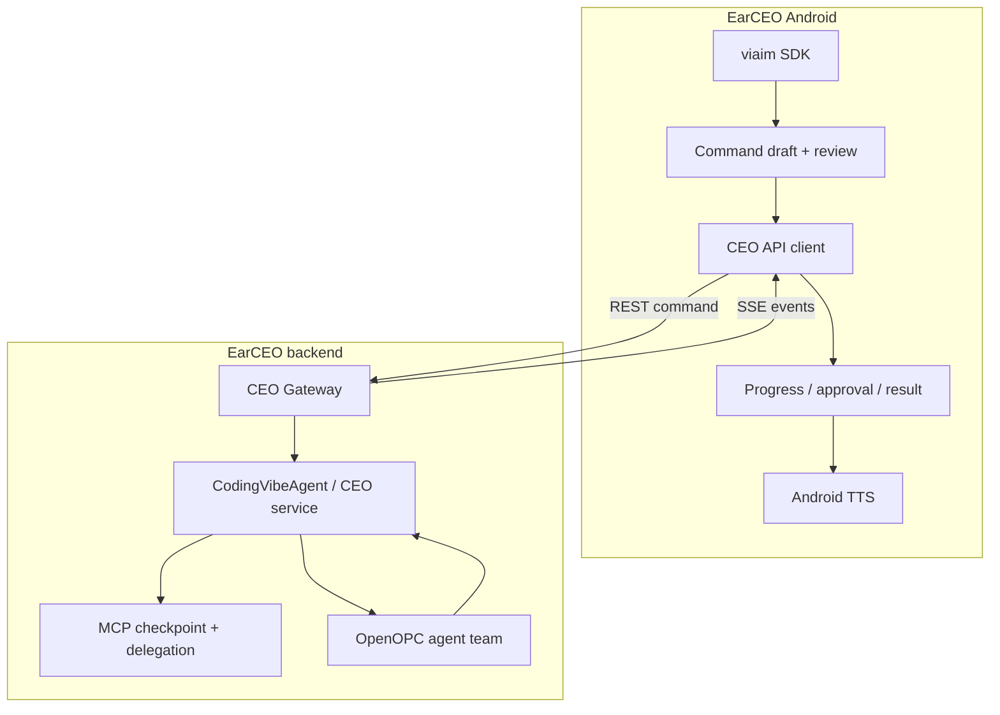

# EarCEO architecture

EarCEO uses two AI layers under one human decision layer:

1. **Human chairperson** — defines the goal, constraints and risk boundary, then
   approves consequential actions.
2. **CEO agent** — compiles voice intent into constrained commands, delegates
   work, tracks state, applies policy and compresses results.
3. **Worker agents** — perform research, implementation, testing and review.

## Runtime components



Both runtime components live in this repository. `android/` owns device and
human-interface state; `backend/` owns accepted turns, durable task state,
repository mapping and agent execution.

## Voice path

```text
iFLYBUDS microphone
  → PCM + WAV (local diagnostics)
  → text-stream Final sentences
  → Android command aggregation
  → human review and submit
  → CEO Gateway
  → coding-vibe CEO
  → worker agents
  → result / approval event
  → Android screen
  → Android TTS
  → headset playback
```

The MVP is half-duplex. Recording stops before TTS playback and resumes only
after playback finishes, preventing the app from interpreting its own voice as
a new command.

## Trust boundaries

- The phone is trusted with the viaim competition credential only for the
  current prototype. A production client should use a safer issued token.
- The phone is never trusted with backend provider or repository credentials.
- The gateway maps a public `project_id` to a server-side allow-listed path.
- The CEO cannot use a voice command as blanket permission for consequential
  actions.
- WAV files remain local unless the human explicitly exports them.

## Risk boundary

| Level | Example | Default policy |
| --- | --- | --- |
| R0 | Read files, search, summarize | Automatic |
| R1 | Generate a draft, run tests | Inform user and allow cancellation |
| R2 | Send a message, publish, deploy a test build | Explicit confirmation |
| R3 | Delete, pay, change permissions, production deploy | Never complete by voice alone |

## State ownership

| State | Source of truth |
| --- | --- |
| Headset connection and recording | Android |
| Active command draft | Android until accepted |
| Accepted turn and idempotency | CEO Gateway |
| Agent task and checkpoints | EarCEO backend |
| Approval status | EarCEO Gateway / backend |
| WAV recording | Android local storage |

The API contract is defined in
[`backend-contract.md`](backend-contract.md). The implementation sequence is in
[`development-plan.md`](development-plan.md).
